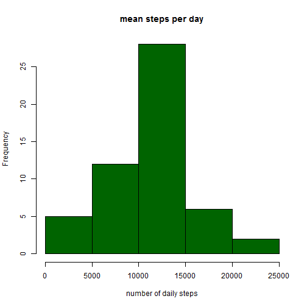
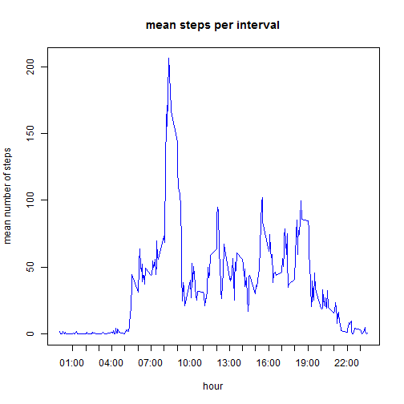
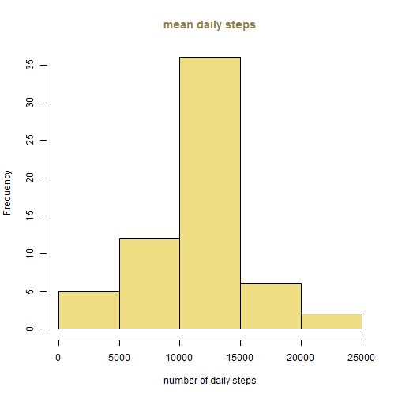
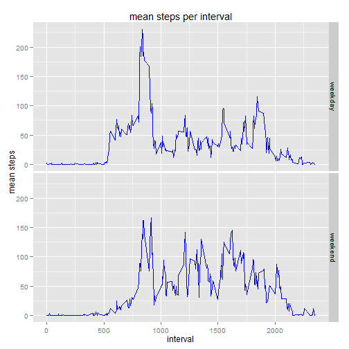

## Loading and preprocessing the data


```r
activity<-read.csv("activity.csv")
```

```
## Warning in file(file, "rt"): cannot open file 'activity.csv': No such file
## or directory
```

```
## Error in file(file, "rt"): cannot open the connection
```

## What is mean total number of steps taken per day?

Processing the data frame to show total steps counts across days:


```r
daily_step<-aggregate(activity$steps, list(date = activity$date), sum)
names(daily_step)<-c("date", "mean")
```

Creating a histogram:


```r
plot<-hist(daily_step$mean, main="mean steps per day", xlab="number of daily steps", col="darkgreen")
```

 

Calculating mean and median steps per day:


```r
mean_step<-mean(daily_step$mean, na.rm=TRUE)                                                
median_step<-median(daily_step$mean, na.rm=TRUE)
```

Mean steps per day: 1.0766189 &times; 10<sup>4</sup>, median steps per day: 10765.


## What is the average daily activity pattern?

Averaging across days the number of steps per each interval:


```r
#mean steps for each interval, na ignored.
interval_mean<-aggregate(activity$steps, list(interval = activity$interval), mean, na.rm=TRUE)
names(interval_mean)<-c("interval", "mean")
```

Plotting the average steps during the day:


```r
#x lables, to be presented in hours format:
ticks<-seq(100, 2300, by=100)
hours<-ticks/100
frmt_hours<-sprintf("%02d:00",hours)
#plot:
plot(interval_mean$interval, interval_mean$mean, type='l', xaxt="n", main="mean steps per interval", xlab="hour", ylab="mean number of steps", col="blue")
axis(side=1, at=ticks, labels=frmt_hours)
```

 

Calculating the interval with most steps, on average, and express it in time of the day:


```r
#looking for interval containing the largest number of steps:
intermax<-interval_mean$interval[which(interval_mean$mean==max(interval_mean$mean))]
int_hour<-intermax%/%100 #the hour
int_min<-intermax%%100 # the minunte
```


On average, the highest amount of steps were done on interval 835, which falls on 8:35 AM.


## Imputing missing values

counting missing values:


```r
na_steps<-sum(is.na(activity$steps))
na_date<-sum(is.na(activity$date))
na_interval<-sum(is.na(activity$interval))
```

2304 values are missing from the steps measuring columns, and no missing values are within the date and the interval columns.

Missing values were replaced with the mean of the non-missing vlaues for this time interval, taken from Q2:


```r
#replace na values with the average for this time inerval:
activity_comp<-activity #keeping the original data and manipulating a different file
for (i in 1:length(activity$steps)){
        if (is.na(activity$steps[i])){
                activity_comp$steps[i]=interval_mean$mean[which(interval_mean$interval==activity$interval[i])]
        }
}
```

Calculating the daily average with the missing values imputed:


```r
#calculating mean total number of steps taken per day?
daily_step_comp<-aggregate(activity_comp$steps, list(date = activity_comp$date), sum)
names(daily_step_comp)<-c("date", "mean")
```

The histogram would now look as follows:


```r
#histogram:
plot<-hist(daily_step_comp$mean, xlab="number of daily steps", col="lightgoldenrod", main='')
title(main="mean daily steps", col.main="lightgoldenrod4") 
```

 

Calculating the mean and the median:


```r
median_comp<-median(daily_step_comp$mean)
mean_comp<-mean(daily_step_comp$mean)
```

Now mean steps per day: 1.0766189 &times; 10<sup>4</sup>, median steps per day: 1.0766189 &times; 10<sup>4</sup>, remarably similar to the values without imputing na values. Thus, the estimated total total number of steps is pracrically the same (though the actual amount maybe different, since the real values are missing, we can't tell).


## Are there differences in activity patterns between weekdays and weekends?

calling more R packages to be used:


```r
library(lubridate)
library(dplyr)
library(ggplot2)
```

Addtional columns is added to the dataset,identifying the day of the week for each date. Then the day of the week is replaced with a factor indicating whether it is a weekday or a weekend day:


```r
#Adding day identifier columns:
activity_comp_wd<-mutate(activity_comp, day=wday(activity_comp$date))

#converting the day identifier to weekday or weekend:
for (i in 1:length(activity_comp_wd$day)){
        if (activity_comp_wd$day[i]%in%c(2,3,4,5,6)){
                activity_comp_wd$day[i]="weekday"}
        else{
                activity_comp_wd$day[i]="weekend"}
}

activity_comp_wd$day<-as.factor(activity_comp_wd$day)
```

Mean steps per inerval is calculated separatedly for weekdays and weekend days:


```r
activity_final<-aggregate(steps~interval+day,activity_comp_wd,FUN=mean)
```

And the plot:


```r
plot<-ggplot(activity_final, aes(interval, steps)) + geom_line(color="blue")+labs(title="mean steps per interval")+ facet_grid(day~.)
plot + ylab("mean steps")
```

 

It seems that weekends peak activity was somewhat later and somewhat less intense, but more steps were taken, on average, during weekned days.
